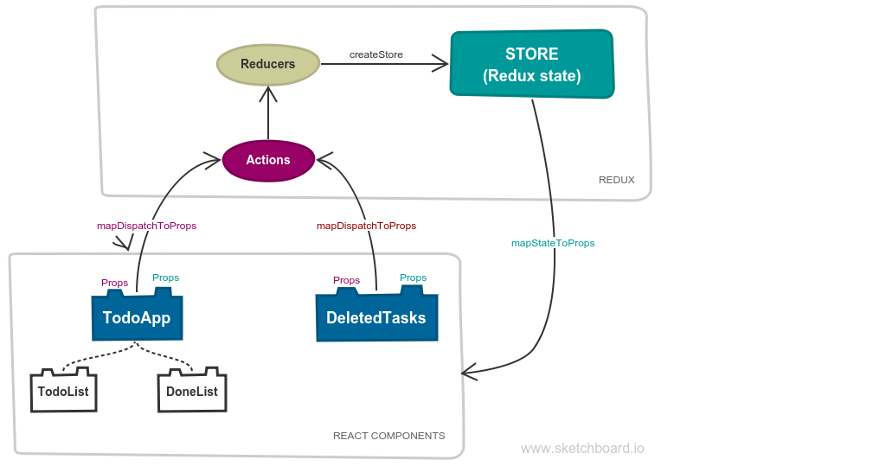

# React-Redux - To-Do list
## Overview

## How you view
You should view step by step when you want to know more about React-Redux in this example:
* Step 0 (`/src/index.js`): Data structures
* Step 1 (`/src/reducers/reducer.js`): Creating reducer
* Step 2 (`/src/actions/todos.action.js`): Creating actions
   * `/src/actions/extra.action.js` is extra action that used for `deleted-tasks.component`
* Step 3 (`/src/components/todos.components.js`)
   * Step 3a: Creating React props by using mapDispatchToProps(). React component will dispatch these actions to change Redux state data
   * Step 3b: Creating React props by using mapStateToProps(). React component will use Redux state data
   * Step 3c: Creating React class component with its props that were created on above steps. View more:
      * `/src/components/lists.component.js` are children components
      * `/src/components/deleted-tasks.component.js` is extra component. It will show you how Redux state works with two components that have the same level. These components are not in relation parent-child.
* Step 4 (`/src/components/todos.components.js`): Creating a container component by using connect()
* Step 5 (`/src/index.js`): Creating a store
* Step 6 (`/src/index.js`): Rendering whole the app by Provider

You can view more about Redux:
* [Core concepts](https://redux.js.org/introduction/coreconcepts)
* [Three principles](https://redux.js.org/introduction/threeprinciples)
* [Redux data flow](https://redux.js.org/basics/dataflow)
* [API reference](https://redux.js.org/api)
   * [Create store](https://redux.js.org/api/createstore)
   * [Store](https://redux.js.org/api/store)

## Screenshot
View on [Codesandbox](https://codesandbox.io/s/7m2nzolvv1)

## Compatibility
Build environment is compatible with:
* Windows
* MacOS
* Debian

## Installation
* Run `npm install` to install all needed packages

## Using
* Run `npm start` or `npm run start` to start your local web server at `localhost:9000`
* Run `npm run build` to build your files from `/src` to `/dist` directory

## Other repositories

You may want to view my other To-Do list examples to know more about Redux and compare what are differences:

* [Redux - Simple To-Do list](https://github.com/nguyenkhois/redux-simple-todo-list)
* [TypeScript - Simple To-Do list](https://github.com/nguyenkhois/typescript-simple-todo-list)
* [React - To-Do list](https://github.com/nguyenkhois/react-todo-list)
* [React-Redux - Simple To-Do list](https://github.com/nguyenkhois/react-redux-simple-todo-list) (It's simpler to understand about React-Redux for beginners)
* [React-Redux - To-Do list](https://github.com/nguyenkhois/react-redux-todo-list)
* [Angular - Simple To-Do list](https://github.com/nguyenkhois/angular-simple-todo-list)
* [Angular-RxJS - To-Do list](https://github.com/nguyenkhois/angular-rxjs-todo-list)