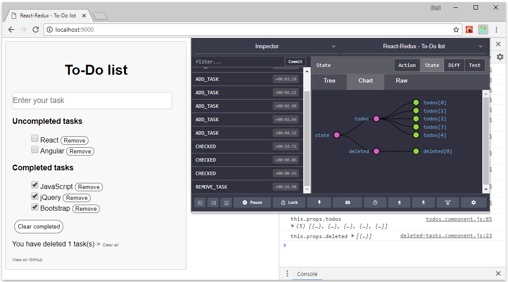

# React-Redux - To-Do list
## How you view
You should view step by step when you want to know more about React-Redux in this example:
* Step 0 (`index.js`): Data structures
* Step 1 (`reducer.js`): Creating reducer
* Step 2 (`actions.js`): Creating actions
* Step 3 (`todos.components.js`)
   * Step 3a: Creating React props from actions by using mapDispatchToProps()
   * Step 3b: Creating React props from Redux state by using mapStateToProps(). It used like local state.
   * Step 3c: Creating React class component with its props that were created on above steps. View more on `lists.component.js`
* Step 4 (`todos.components.js`): Creating a container component by using connect() function
* Step 5 (`index.js`): Creating a store
* Step 6 (`index.js`): Rendering whole the app by Provider

You can view more about Redux:
* [Core concepts](https://redux.js.org/introduction/coreconcepts)
* [Three principles](https://redux.js.org/introduction/threeprinciples)
* [Redux data flow](https://redux.js.org/basics/dataflow)
* [API reference](https://redux.js.org/api)
   * [Create store](https://redux.js.org/api/createstore)
   * [Store](https://redux.js.org/api/store)

## Screenshot
View on [Codesandbox](https://codesandbox.io/s/7m2nzolvv1)

## Compatibility
Build environment is compatible with:
* Windows
* MacOS
* Debian

## Installation
* Run `npm install` to install all needed packages

## Using
* Run `npm start` or `npm run start` to start your local web server at `localhost:9000`
* Run `npm run build` to build your files from `/src` to `/dist` directory

## Other repositories

You may want to view my other To-Do list examples to know more about Redux and compare what are differences:

* [Redux - Simple To-Do list](https://github.com/nguyenkhois/redux-simple-todo-list)
* [TypeScript - Simple To-Do list](https://github.com/nguyenkhois/typescript-simple-todo-list)
* [React - To-Do list](https://github.com/nguyenkhois/react-todo-list)
* [React-Redux - Simple To-Do list](https://github.com/nguyenkhois/react-redux-simple-todo-list) (It's simpler to understand about React-Redux for beginners)
* [Angular - Simple To-Do list](https://github.com/nguyenkhois/angular-simple-todo-list)
* [Angular-RxJS - To-Do list](https://github.com/nguyenkhois/angular-rxjs-todo-list)